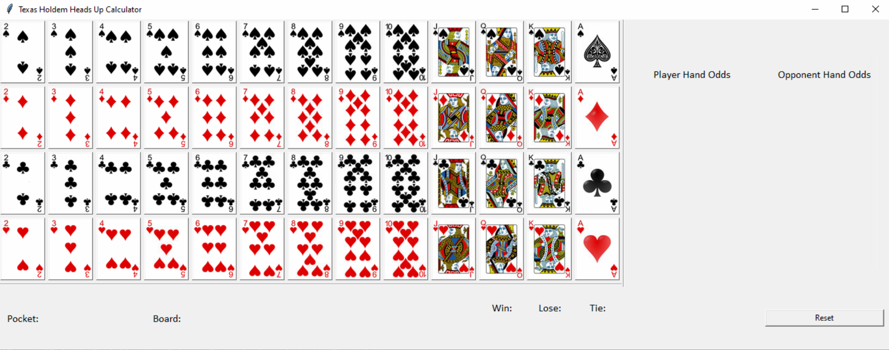
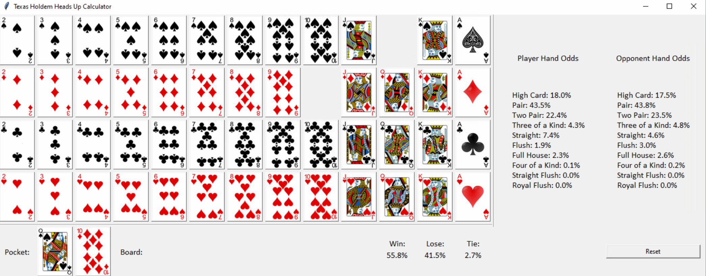
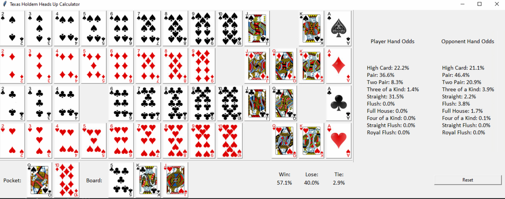
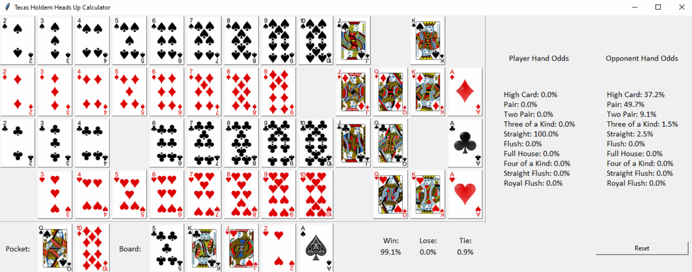

Holdem Odds Calculator
=================

The Holdem Odds Calculator application calculates the probability 
that a certain Texas Hold'em hand will win in heads-up. Heads-up poker 
refers to any form of the game in which the hand is played out 
between just two players. The chance or likelihood is estimated 
by using a Monte Carlo method or by precisely simulating every 
potential hand. The Holdem Calculator indicates the probability 
of each pair of cards forming specific poker hands. Typically, 
the default Monte Carlo simulations are precise to the closest 
percent. If more simulations are conducted, accuracy can be 
enhanced, but it will take more time to run these simulations.

Starting the Application
-----

### Prerequisites

- Python installed on your local machine. If Python is not installed, download and install it from [Python's official website](https://www.python.org/).


### Clone the Repository

```bash
git https://github.com/tmourtos/holdem_odds_calculator.git
cd holdem_odds_calculator
```

### Running the Application
Start the Application:

Run the odds_calculator.py script using the following command:

```bash
python odds_calculator.py
```

### Application Interaction
* Clicking on a card add it to pocket or board. Clicking it while
being on pocket or board it returns it to the deck.
* Clicking on reset it resets the whole board.
* On the right, user can see the player's odds and the opponent's odds.
Odds of winning improve if user has higher odds in the following
hands (in descending order):
  * Royal Flush
  * Straight Flush
  * Four of a Kind
  * Full House
  * Flush
  * Straight
  * Three of a Kind
  * Two Pair
  * Pair
  * High Card
* Total odds of Winning, Drawing or Losing also appear in the
bottom center of the application.

### Usage Examples

* #### New Round

* #### Pre-Flop

* #### Flop

* #### Turn & River


Acknowledgements
=================

This project is built upon and incorporates code from the 
following source:

- Kevin Tseng for the [Holdem Calculator]((https://github.com/ktseng/holdem_calc)) base code used in this code.

I acknowledge and thank him for his contribution in building this project.

## Copyright

Copyright (c) 2020 Tasos Mourtopallas. See [LICENSE](https://github.com/tmourtos/holdem_odds_calculator/blob/master/LISCENSE) for details.
